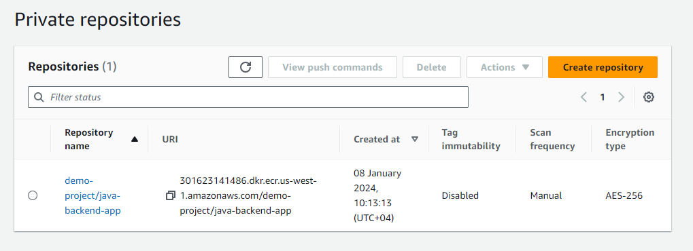
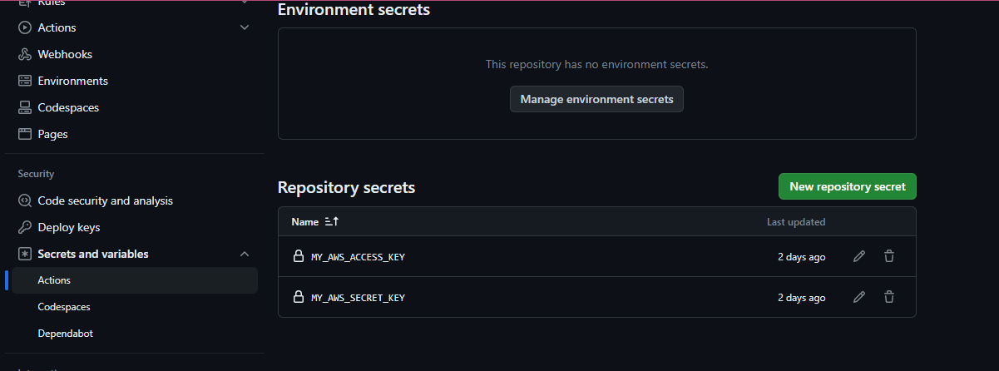
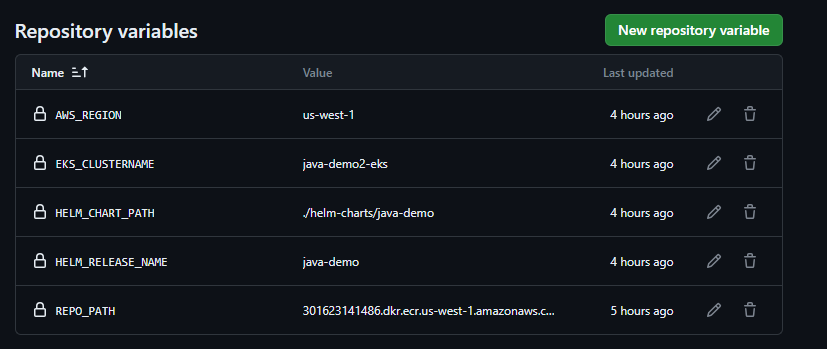

Project - java-github-actions-cicd-eks-terraform
-----------

In this project, We will be deploying a hello-world java application to EKS cluster using Github actions. 
We will be testing the application at different stages.

Stage1 : Testing at local environment

Stage2 : Containerise the application and test using Docker

Stage3 : Launch the EKS cluster using terraform and ECR repository

Stage4 : Create the github actions pipeline and test CI and CD

Stage5 : Test the CI-CD by changing application version to V2

Stage6 : Cleanup the resources created

-----------

Prerequisites:
Require below tools installed in local machine or on a VM

- Java v17
- maven
- Terraform
- Docker

- AWS Access key and Secret
- aws-cli is installed and configured
- S3 bucket to store terraform statefile

-----------

Fork this repository and clone your repository to your local machine

https://github.com/mahroofpk/java-github-cicd-eks-terraform

**Stage1:** Testing at local environment

- Verify Java version is 17 using commands

`java -version` , 
`mvn -version`

Navigate to the code directory - 
`cd java_backend_code/`

- Build the application using command - 
`mvn clean install`

- Once the Build is success run command -  
`java -jar target/spring-boot-docker.jar`

- Test the application with 
http://localhost:8080/hello

Expected output:
`Hello World!, Welcome to the Demo : V1`

-----------

**Stage2:**

Let's now containarise the application and test the docker image

From path `java-github-cicd-eks-terraform/java_backend_code`

Execute commands

Building Docker Image using Dockerfile - 
`docker build -t java-backend:v1 .`

Once the image is built, Verify by running `docker images`

Then run
`docker run -p 8080:8080 java-backend:v1 --rm`

- Test the application with 
http://localhost:8080/hello

Expected output:
Hello World!, Welcome to the Demo : V1

-----------

**Stage3:** - Create eks cluster using terraform and create ECR Repository

Navigate to the terraform directory
`cd java-github-cicd-eks-terraform/terraform-eks`

Replace s3 bucket and statefilename in backend.tf

From my Example:

`bucket = "eks-demo-tfstate-bucket"`
`key    = "eks/terraform.tfstate"`

Variabled are defined in `variable.tf`. EKS clustername is set as `java-demo-eks`.
You can change variables if needed.

Run
`Terraform init`

Once init is Success, Run
`Terraform plan`
`Terraform validate`

`terraform apply -auto-approve`

Once the cluster and related components are launched,
Run this command to access the cluster from local machine

`aws eks update-kubeconfig --region us-west-1 --name java-demo-eks`

Verify the cluster access by running - 
`kubectl get nodes`

If you see the kubernetes nodes in output, That means we're able to connect to EKS cluster from local.

Let's now create the ECR repository

`aws ecr create-repository --repository-name <repositoryname> --region <region>`

Ex: aws ecr create-repository --repository-name demo-project/java-backend-app --region us-west-1

You can see repository uri like
301623141486.dkr.ecr.us-west-1.amazonaws.com/demo-project/java-backend-app

-----------

**Stage4 :**

We're now going to setup github actions CI CD pipeline.

First, We need to add few secrets and Variables in github

Goto Secrets --> Create New Repository Secret
https://github.com/<your_github_id>/java-github-cicd-eks-terraform/settings/secrets/actions

Add below secrets
1. Name - `MY_AWS_ACCESS_KEY`
   Secret - `<Your AWS Access Key>`

2. Name - `MY_AWS_SECRET_KEY`
   Secret - `<Your AWS Secret Key>`

Now, navigate to Variables --> Create New Repository Variable
https://github.com/<your_github_id>/java-github-cicd-eks-terraform/settings/variables/actions

Add below variables
1. Name: AWS_REGION
   Value: us-west-1
2. Name: EKS_CLUSTERNAME
   Value: java-demo-eks
3. Name: HELM_CHART_PATH
   Value: ./helm-charts/java-demo
4. Name: HELM_RELEASE_NAME
   Value: java-demo

Next step is to enable Github Actions

Goto
https://github.com/<your_github_id>/java-github-cicd-eks-terraform/actions

Click on `set up a workflow yourself`

Name the workflow filename as `github-actions-cicd.yml`
and paste the contents from github-actions-cicd.yml file available at repository path `java-github-cicd-eks-terraform/.github/workflows`

Once copied in the github ui, Commit the changes.

You should see github-actions-cicd.yml file at your repository
`https://github.com/<your_github_id>/java-github-cicd-eks-terraform/tree/main/.github/workflows`

In Actions, you can see a pipeline running

Once the CI and CD job is complete, You can check the status pods and access the application through loadbalancer endpoint

Check the pod status and loadbalancer service endpoint

`kubectl get pods`
`kubectl get svc`

Test the application
`http://<loadbalancer endpoint>/hello`

Expected output:
Hello World!, Welcome to the Demo : V1

-----------

**Stage5 :** - End-to-End CICD test

Change the application version to V2
`https://github.com/<your_github_id>/java-github-cicd-eks-terraform/blob/main/java_backend_code/src/main/java/com/demo_backend_project/DemoApplication.java`

and push the code.

Wait for the new github action pipeline to complete. You should see v2 version in the UI

-----------

**Stage6 :**

Run
1. `helm uninstall java-demo`

2. Navigate to terraform-eks directory and run
`terraform destroy -auto-approve`

Check the terraform output and verify all the resources are destroyed

3. Delete the ECR Repository
   `aws ecr delete-repository --repository-name demo-project/java-backend-app --force`

-----------

